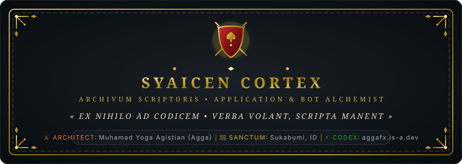
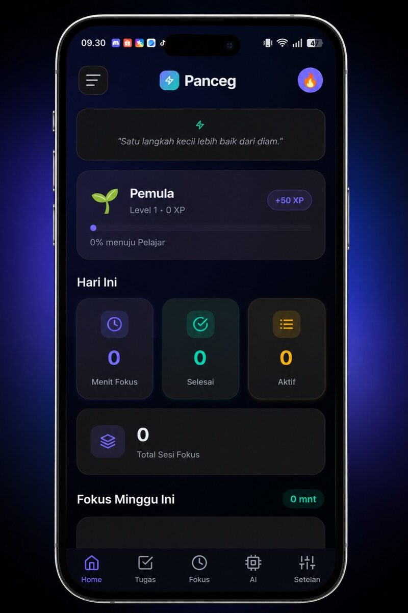
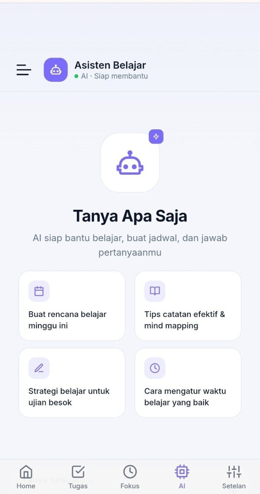
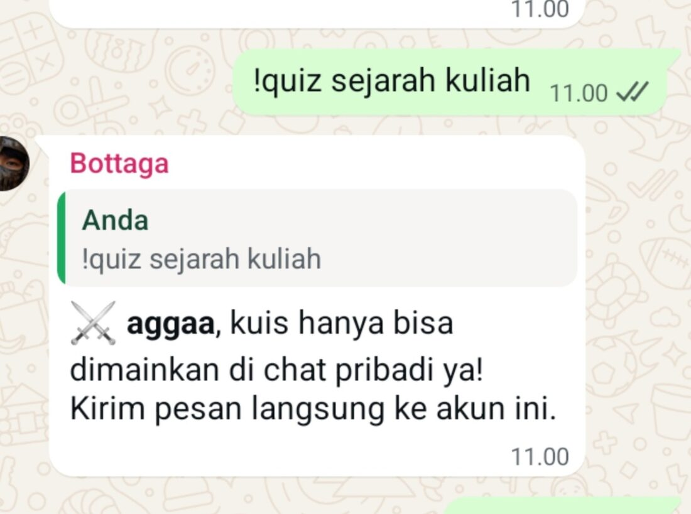
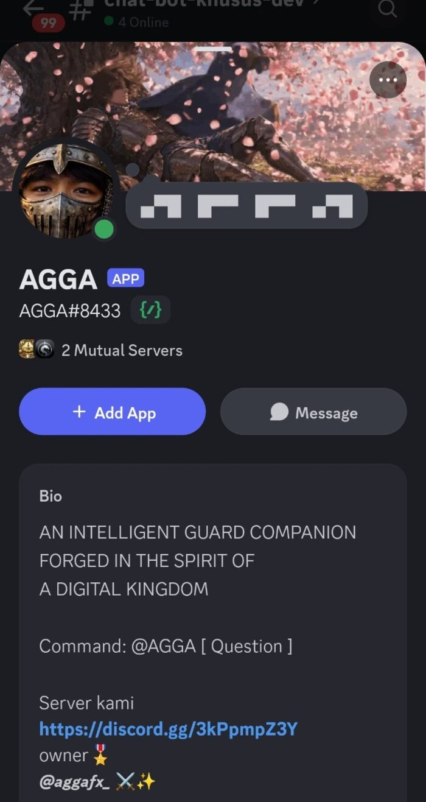
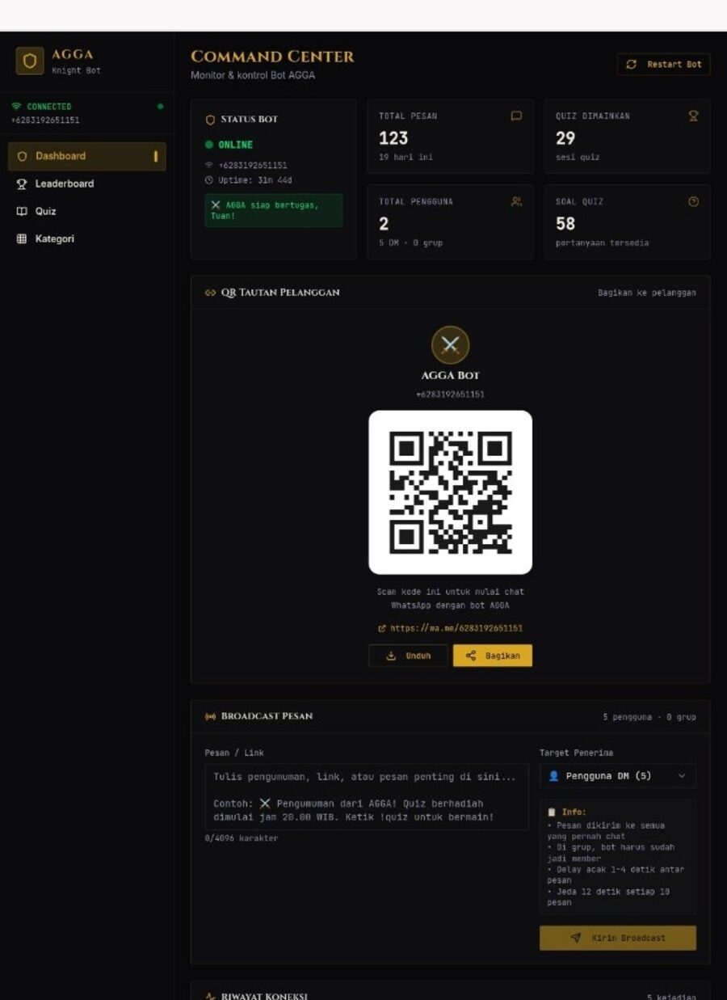

<div align="center">



<br/>

[](https://aggafx.is-a.dev)
[](https://discord.gg/qU4cTcKJp)
[](mailto:pancegapp@gmail.com)
[](https://instagram.com/agga.fx)

<p align="center">
  <em>« Verba volant, scripta manent. In codice veritas. »</em><br/>
  <b>Welcome to the Sanctum of SYAICEN CORTEX</b> — The digital archive of application engineering, autonomous automata, and multi-protocol agent systems.
</p>


</div>

<br/>

## ⚜️ Prolegomena • The Architect's Chronicle

> *"In eras past, master alchemists transformed base elements into gold upon aged vellum. Today, we forge event loops, socket streams, and autonomous intelligence into resilient digital architecture."*

Behind **SYAICEN CORTEX** operates **Muhamad Yoga Agistian (Agga)** — an *Application & Bot Systems Engineer* and *Hardware Diagnostician* based in Sukabumi, Indonesia. Specializing in high-concurrency bot infrastructure (WhatsApp & Discord protocols), cognitive productivity suites, modular web architectures, and state-of-the-art Autonomous AI agent orchestration.

```yaml
Architect: Muhamad Yoga Agistian (Agga)
Location: Sukabumi, West Java, Indonesia
Core_Disciplines: Application Engineering, Bot Systems Architecture, Autonomous AI Agents
Official_Registry: aggafx.is-a.dev (Mirror: aggafx.vercel.app)
Current_Status: ⚔️ Actively Engineering (Productivity Systems & Autonomous Workflows)
```

<div align="center">
  
</div>

<br/>

## 📜 The Grand Codex • Featured Engineering Works

Every system documented below is backed by verified architectural implementation, active codebases, and tangible execution:

### 1. 🛡️ Panceg App — *The Sanctum of Cognitive Focus & Study*
> **Full-Stack Productivity Platform, Smart Task Blocker, & Adaptive AI Study Companion**

* **Mission:** Designed to eliminate modern digital friction and cognitive overload through intelligent task scheduling, adaptive focus sessions, and guided study companions.
* **Key Architecture & Features:**
  * **AI Study Buddy:** Context-aware interactive assistant providing guided summarization, active-recall examination drills, and intelligent study pacing.
  * **Smart Task Blocker:** Adaptive distraction shield built around user-defined deep work intervals.
  * **Ergonomic Dark Parchment UI:** High-fidelity, mobile-first responsive interface tailored for prolonged cognitive sessions.
* **Tech Stack & Deployment:** `TypeScript`, `Node.js`, `Express`, `Tailwind CSS`, `Replit Runtime`, `Vercel Edge`.

<div align="center">
  <table>
    <tr>
      <td width="50%" align="center">
        <b>📱 Primary Interface (Focus Sanctum)</b><br/><br/>
        
      </td>
      <td width="50%" align="center">
        <b>🧠 Cognitive Assistant (AI Study Buddy)</b><br/><br/>
        
      </td>
    </tr>
  </table>
</div>

---

### 2. 🔮 The WhatsApp Oracle — *Interactive Quiz & Mystery Automaton*
> **High-Throughput Community Bot Engine for Group Interaction, Stateful Quizzes & Logic Mysteries**

* **Mission:** Built directly atop raw WebSocket protocols to deliver instantaneous, zero-overhead group automation without relying on heavy headless browser instances.
* **Key Architecture & Features:**
  * **High-Speed Mention Engine:** Low-latency group mention parser that delivers context-aware responses and game triggers.
  * **Stateful Quiz & Mystery Core:** Real-time scoring state machine, sequential multi-round trivia, logic puzzles, and competitive group leaderboards.
  * **Anti-Spam & Rate-Limiting Armor:** Traffic throttling and queue management to guarantee session persistence and prevent socket disconnects.
* **Tech Stack & Deployment:** `TypeScript`, `Node.js`, `Baileys WebSocket Protocol`, `Finite-State Machine Architecture`.

<div align="center">
  <b>⚡ Operational Flow • Interactive Quiz & Community Automation Engine</b><br/><br/>
  
</div>

---

### 3. ⚔️ AGGA Discord Automaton & Custom Rich Presence
> **Guild Infrastructure Automaton, Modular Command Dispatcher & Real-Time RPC Engine**

* **Mission:** Comprehensive management automaton powering the *"The History Round Table"* Discord ecosystem, unified with custom Rich Presence (RPC) dispatching dynamic player status.
* **Key Architecture & Features:**
  * **Modular Command Registry:** Dynamic command loader managing administrative automations, server utilities, and automated event handlers.
  * **Custom Rich Presence (RPC):** Custom Discord client pipeline rendering real-time game status and activity telemetry on user profiles.
* **Tech Stack & Deployment:** `Python`, `Discord.py`, `Discord Gateway API`, `JSON State Persistence`.

<div align="center">
  <table>
    <tr>
      <td width="50%" align="center">
        <b>🛡️ Bot Identity & Modular Command Suite</b><br/><br/>
        
      </td>
      <td width="50%" align="center">
        <b>📊 AGGA Command Center & Analytics Dashboard</b><br/><br/>
        
      </td>
    </tr>
  </table>
</div>

<div align="center">
  
</div>

<br/>

## 🤖 The Alchemical AI Engines & Agentic Platforms

Modern engineering requires orchestrating cutting-edge **Autonomous AI Agents**, cloud sandboxes, and rigorous model benchmarking environments:

| Order & Platform | Architectural Role & Tangible Implementation |
| :--- | :--- |
|  **[Skydive.com](https://skydive.com)** | **Agent Runtime & Autonomous Harness:** Orchestrating cloud sandboxes, multi-turn AI tool execution, scheduled background routines, and autonomous engineering workflows. |
|  **[Replit](https://replit.com)** | **Cloud Forge & Continuous Deployment:** Rapid prototyping environment, containerized backend hosting, and 24/7 runtime execution for bot services. |
|  **[Lovable.dev](https://lovable.dev)** | **Full-Stack Prototyping Accelerator:** High-velocity full-stack UI scaffolding, reactive component synthesis, and layout ergonomics. |
|  **[Arena.ai (LMSYS)](https://chat.lmsys.org)** | **LLM Benchmarking & Prompt Evaluation:** Head-to-head empirical model evaluation (Claude, Gemini, GPT, DeepSeek) to optimize latency and reasoning quality for agent prompts. |
|  **[Vercel Edge](https://vercel.com)** | **Edge Infrastructure & CDN:** Serverless deployment pipeline powering global distribution and zero-latency delivery for production web assets. |

<div align="center">
  
</div>

<br/>

## ⚔️ Armory of the Craft • Technical Repertoire

```text
 ╔═══════════════════════════════════════════════════════════════════════════════════════╗
 ║  LANGUAGES & LOGIC   : TypeScript • Python • JavaScript • Modern HTML5/CSS • SQL     ║
 ║  FRAMEWORKS & LIBS   : Node.js • Express • Tailwind CSS • Baileys Socket • Discord.py ║
 ║  BOT ARCHITECTURES   : Event-Driven Sockets • Webhook Pipelines • Rich Presence (RPC) ║
 ║  INFRA & DEPLOYMENT  : Vercel • Replit • Linux Cloud Sandboxes • Git Automation       ║
 ║  VISUAL & HARDWARE   : Mobile Hardware Diagnostics • Vector Assets • UI Ergonomics   ║
 ╚═══════════════════════════════════════════════════════════════════════════════════════╝
```

<div align="center">
  
  
  
  
  
  
  
</div>

<div align="center">
  
</div>

<br/>

## 🛡️ The Proof-of-Work Vault • Artifacts & Verification

Every milestone showcased here is grounded in actual commits, verified architectures, and live demonstrations:

| Index | Artifact / System | Domain & Scope | Source / Verification Link |
| :-: | :--- | :--- | :--- |
| **01** | **Panceg App Core** | Full-Stack Productivity Suite | [Review Documentation & Visuals](#1-️-panceg-app--the-sanctum-of-cognitive-focus--study) • `Panceg-FIX--PERBAIKAN-` |
| **02** | **WhatsApp Quiz Oracle** | WebSocket Bot & State Engine | [Review Operational Architecture](#2--the-whatsapp-oracle--interactive-quiz--mystery-automaton) • `Bot-whatsapp` |
| **03** | **AGGA Discord Bot & RPC** | Python Community Automaton | [Review Guild Command Dispatcher](#3-️-agga-discord-automaton--custom-rich-presence) • `Discord-bot-AGGA` |
| **04** | **Official Web Portal** | Production Portfolio & Live Showcase | [Visit aggafx.is-a.dev](https://aggafx.is-a.dev) *(Mirror: [aggafx.vercel.app](https://aggafx.vercel.app))* |
| **05** | **Subdomain Registrar** | DNS Protocol & Open-Source Contrib | Verified Registry at `is-a.dev` (`register`) |

<div align="center">
  
</div>

<br/>

## 📬 The Heraldry Portal • Official Channels & Inquiries

The sanctum's gates remain open for engineering inquiries, bot architecture consultations, and collaborative agent workflows:

<div align="center">

| Channel | Destination / Inscription | Scope of Discussion |
| :--- | :--- | :--- |
| ✉️ **Electronic Raven (Email)** | [**pancegapp@gmail.com**](mailto:pancegapp@gmail.com) | Professional inquiries, architectural contracts, and formal proposals |
| 🟣 **Discord Guild** | [**The History Round Table**](https://discord.gg/qU4cTcKJp) | Interactive community sanctuary, bot trials, and technical dialogue |
| 📸 **Visual Portfolio** | [**@agga.fx**](https://instagram.com/agga.fx) | UI design curation, visual assets, and hardware diagnostics showcase |
| 🏛️ **Official Web Codex** | [**aggafx.is-a.dev**](https://aggafx.is-a.dev) | Interactive live portfolio, comprehensive resume, and deployment hub |

<br/>

> *Note: Direct messaging via instant messengers is accessible upon formal request via email or the official web portal.*

<br/>

```
      ⚔️  SYAICEN CORTEX  •  FORGED WITH INTELLECT, CODE & ALCHEMY  ⚔️
```


<sub>© 2026 Muhamad Yoga Agistian (SYAICEN CORTEX). All sacred rites & rights reserved.</sub>

</div>