<div align="center">


<br/>



<br/>

[](https://aggafx.is-a.dev)
[](https://discord.gg/qU4cTcKJp)
[](mailto:pancegapp@gmail.com)
[](https://instagram.com/agga.fx)

<p align="center">
  <em>« Verba volant, scripta manent. In codice veritas. »</em><br/>
  <b>Application & Bot Systems Engineer</b> focused on high-concurrency bot infrastructure, focus-driven productivity platforms, and Autonomous AI Agent orchestration.
</p>


</div>

<br/>

## 👤 Executive Profile & Overview

I am **Muhamad Yoga Agistian (Agga)**, a software engineer and hardware diagnostician based in Sukabumi, Indonesia. I design and ship production-ready applications, high-throughput community automata, and agentic workflows.

My engineering philosophy bridges **low-overhead systems design** (raw WebSocket protocols, state machines, and resilient queues) with **human-centric interfaces** (mobile-first ergonomics, distraction-free productivity environments, and interactive AI companions).

- 🔭 **Current Focus:** Scaling autonomous AI workflows, multi-platform bot engines, and cognitive focus systems.
- ⚡ **Engineering Principles:** Zero fluff, verified execution, resilient failure-recovery, and clean architecture.
- 🏰 **Digital Sanctum & Portfolio:** [aggafx.is-a.dev](https://aggafx.is-a.dev) *(Mirror: [aggafx.vercel.app](https://aggafx.vercel.app))*
- 📫 **Direct Inquiries:** [pancegapp@gmail.com](mailto:pancegapp@gmail.com)

```yaml
Architect: Muhamad Yoga Agistian (Agga)
Specializations: Application Engineering, High-Throughput Automata, Autonomous Agent Pipelines
Sanctum: Sukabumi, West Java, Indonesia
Registry: aggafx.is-a.dev • aggafx.vercel.app
Status: ⚔️ Actively Shipping & Engineering
```

<div align="center">
  
</div>

<br/>

## 💼 Core Disciplines & What I Do

```
┌───────────────────────────────┬───────────────────────────────┬───────────────────────────────┐
│  🤖 High-Throughput Bots      │  🛡️ Productivity Applications │  🧠 Agentic AI & Workflows    │
├───────────────────────────────┼───────────────────────────────┼───────────────────────────────┤
│ • Raw WebSocket Baileys socket│ • Distraction-shield engines  │ • Multi-turn tool harnesses   │
│ • Finite-state game machines  │ • Cognitive focus intervals   │ • Prompt benchmark evaluation │
│ • Group mention event routing │ • AI Study Buddy integration  │ • Automated scheduled cron    │
│ • Discord Guild RPC pipelines │ • Mobile-first ergonomics     │ • Edge serverless pipelines   │
└───────────────────────────────┴───────────────────────────────┴───────────────────────────────┘
```

<div align="center">
  
</div>

<br/>

## 📜 The Grand Codex • Featured Engineering Works

Every project documented below represents authentic, working software backed by source code, real-time socket connections, and validated visual proof:

### 1. 🛡️ Panceg App — *The Sanctum of Cognitive Focus & Study*
> **Full-Stack Productivity Platform, Intelligent Task Blocker, & Adaptive AI Study Companion**

* **Problem Solved:** Modern digital interfaces cause severe attention fragmentation. Panceg acts as a cognitive defense platform that shields productive flow states while integrating active AI guidance.
* **Engineering Highlights:**
  * **AI Study Buddy:** Contextual assistant offering structured summarization, active-recall drills, and study cadence orchestration.
  * **Smart Blocker & Interval Defense:** Adaptive habit protector structured around focused work intervals.
  * **Parchment Dark Architecture:** High-contrast ergonomic UI designed for sustained cognitive load.
* **Technical Stack:** `TypeScript`, `Node.js`, `Express`, `Tailwind CSS`, `Replit Cloud Forge`, `Vercel Edge`.

<div align="center">
  <table>
    <tr>
      <td width="50%" align="center">
        <b>📱 Focus Sanctum — Primary Application Dashboard</b><br/><br/>
        
      </td>
      <td width="50%" align="center">
        <b>🧠 AI Study Buddy — Context-Aware Guidance Dialog</b><br/><br/>
        
      </td>
    </tr>
  </table>
</div>

---

### 2. 🔮 The WhatsApp Oracle — *Interactive Quiz & Mystery Automaton*
> **High-Concurrency Community Bot Engine for Group Interaction, Stateful Quizzes & Logic Mysteries**

* **Problem Solved:** Running automated group bots via heavy headless Chromium browsers leads to massive memory usage and frequent bans. Built directly on raw WebSocket socket connections for near-zero latency and minimal server footprint.
* **Engineering Highlights:**
  * **High-Speed Group Mention Engine:** Instant trigger and NLP parsing when summoned inside active WhatsApp groups.
  * **Finite-State Machine Quiz Master:** Multi-round sequential trivia, stateful leaderboards, point accumulation, and interactive logic mysteries.
  * **Session Persistence & Anti-Ban Throttling:** Packet rate-limiting and message queueing to safeguard numbers and ensure 24/7 uptime.
* **Technical Stack:** `TypeScript`, `Node.js`, `Baileys WebSocket Protocol`, `State-Machine Engine`.

<div align="center">
  <b>⚡ Operational Flow • Interactive Quiz & Community Automation Engine</b><br/><br/>
  
</div>

---

### 3. ⚔️ AGGA Discord Automaton & Custom Rich Presence
> **Guild Infrastructure Automaton, Modular Command Dispatcher & Real-Time RPC Engine**

* **Problem Solved:** Providing automated administrative control and immersive telemetry for *"The History Round Table"* Discord community.
* **Engineering Highlights:**
  * **Modular Command Loader:** Decoupled handler allowing dynamic command registration without restarting the bot gateway.
  * **Custom Rich Presence (RPC):** Custom Discord gateway telemetry broadcasting live player activity, system metrics, and server status.
* **Technical Stack:** `Python`, `Discord.py`, `Discord Gateway API`, `JSON State Persistence`.

<div align="center">
  <table>
    <tr>
      <td width="50%" align="center">
        <b>🛡️ Bot Identity & Modular Command Suite</b><br/><br/>
        
      </td>
      <td width="50%" align="center">
        <b>📊 AGGA Command Center & Analytics Dashboard</b><br/><br/>
        
      </td>
    </tr>
  </table>
</div>

<div align="center">
  
</div>

<br/>

## 🤖 AI Engines, Autonomous Agents & Cloud Platforms

Modern product development requires the deliberate orchestration of autonomous engineering agents, cloud sandboxes, and empirical model benchmarks:

| Order & Platform | Architectural Role & Tangible Implementation |
| :--- | :--- |
|  **[Skydive.com](https://skydive.com)** | **Agent Runtime & Autonomous Harness:** Orchestrating cloud sandboxes, multi-turn AI tool execution, scheduled background routines, and autonomous engineering workflows. |
|  **[Replit](https://replit.com)** | **Cloud Forge & Continuous Deployment:** Rapid prototyping environment, containerized backend hosting, and 24/7 runtime execution for bot services. |
|  **[Lovable.dev](https://lovable.dev)** | **Full-Stack Prototyping Accelerator:** High-velocity full-stack UI scaffolding, reactive component synthesis, and layout ergonomics. |
|  **[Arena.ai (LMSYS)](https://chat.lmsys.org)** | **LLM Benchmarking & Prompt Evaluation:** Head-to-head empirical model evaluation (Claude, Gemini, GPT, DeepSeek) to optimize latency and reasoning quality for agent prompts. |
|  **[Vercel Edge](https://vercel.com)** | **Edge Infrastructure & CDN:** Serverless deployment pipeline powering global distribution and zero-latency delivery for production web assets. |

<div align="center">
  
</div>

<br/>

## ⚔️ Technical Armory • Languages & Tools

```text
 ╔═══════════════════════════════════════════════════════════════════════════════════════╗
 ║  LANGUAGES & RUNTIMES : TypeScript • Python • JavaScript • Node.js • Modern HTML5/CSS ║
 ║  FRAMEWORKS & LIBRARIES: Express.js • Tailwind CSS • Baileys Protocol • Discord.py    ║
 ║  SYSTEMS & PROTOCOLS  : Event-Driven Sockets • Webhook Handlers • Discord Gateway RPC ║
 ║  INFRA & DEPLOYMENTS  : Vercel Edge • Replit Cloud • Linux Ephemeral Sandboxes • Git  ║
 ║  CRAFT & HARDWARE     : Mobile Hardware Diagnostics • Vector Artwork • UI Ergonomics  ║
 ╚═══════════════════════════════════════════════════════════════════════════════════════╝
```

<div align="center">
  
  
  
  
  
  
  
</div>

<div align="center">
  
</div>

<br/>

## 📊 Telemetry & Engineering Metrics

<div align="center">


<br/>


</div>

<div align="center">
  
</div>

<br/>

## 🛡️ The Proof-of-Work Vault • Verified Milestones

| Index | Artifact / System | Domain & Scope | Verified Proof Link |
| :-: | :--- | :--- | :--- |
| **01** | **Panceg App Core** | Full-Stack Productivity Platform | [Review Documentation & Visuals](#1-️-panceg-app--the-sanctum-of-cognitive-focus--study) • `Panceg-FIX--PERBAIKAN-` |
| **02** | **WhatsApp Quiz Oracle** | WebSocket Bot & State Engine | [Review Operational Architecture](#2--the-whatsapp-oracle--interactive-quiz--mystery-automaton) • `Bot-whatsapp` |
| **03** | **AGGA Discord Bot & RPC** | Python Community Automaton | [Review Guild Command Dispatcher](#3-️-agga-discord-automaton--custom-rich-presence) • `Discord-bot-AGGA` |
| **04** | **Official Web Portal** | Production Portfolio & Live Showcase | [Visit aggafx.is-a.dev](https://aggafx.is-a.dev) *(Mirror: [aggafx.vercel.app](https://aggafx.vercel.app))* |
| **05** | **Subdomain Registrar** | DNS Protocol & Open-Source Contrib | Verified Registry at `is-a.dev` (`register`) |

<div align="center">
  
</div>

<br/>

## 📬 The Heraldry Portal • Official Channels & Inquiries

The sanctum's gates remain open for engineering inquiries, bot architecture consultations, and collaborative agent workflows:

<div align="center">

| Channel | Destination / Inscription | Scope of Discussion |
| :--- | :--- | :--- |
| ✉️ **Electronic Raven (Email)** | [**pancegapp@gmail.com**](mailto:pancegapp@gmail.com) | Professional inquiries, architectural contracts, and formal proposals |
| 🟣 **Discord Guild** | [**The History Round Table**](https://discord.gg/qU4cTcKJp) | Interactive community sanctuary, bot trials, and technical dialogue |
| 📸 **Visual Portfolio** | [**@agga.fx**](https://instagram.com/agga.fx) | UI design curation, visual assets, and hardware diagnostics showcase |
| 🏛️ **Official Web Codex** | [**aggafx.is-a.dev**](https://aggafx.is-a.dev) | Interactive live portfolio, comprehensive resume, and deployment hub |

<br/>

> *Note: Direct messaging via instant messengers is accessible upon formal request via email or the official web portal.*

<br/>

```
      ⚔️  SYAICEN CORTEX  •  FORGED WITH INTELLECT, CODE & ALCHEMY  ⚔️
```


<sub>© 2026 Muhamad Yoga Agistian (SYAICEN CORTEX). All sacred rites & rights reserved.</sub>

</div>